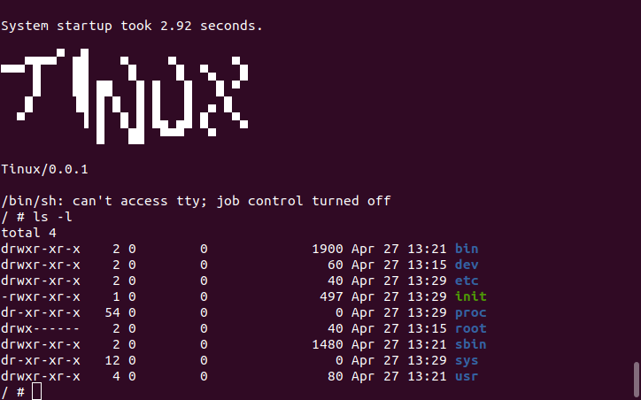

# Tinux

Using Tinux, you can build your very own, tiny ([Busybox](https://busybox.net/) based) [Linux](https://kernel.org/) distribution.

[](https://github.com/vaibhavpandeyvpz/tinux/actions/workflows/build.yml)



For a full-fledged desktop grade distribution being built in open, see [https://github.com/vaibhavpandeyvpz/tejas](https://github.com/vaibhavpandeyvpz/tejas).

### Requirements

Before starting to build, you will need to have dependencies installed on your build machine. Running below command will help you install it on most [Ubuntu](https://ubuntu.com/) based machines but you may easily adapt it to operating system of your choice if you now it well.

```bash
sudo apt install bison build-essential flex libelf-dev libncurses-dev libssl-dev qemu qemu-kvm xz-utils
```

### Pre-built ISOs

Pre-built bootable ISOs are automatically generated for the following variants:

- **Kernel 6.18.2** with Busybox 1.37.0
- **Kernel 5.15.197** with Busybox 1.37.0

You can download ISOs from:

- **Releases**: Check the [Releases](https://github.com/vaibhavpandeyvpz/tinux/releases) page for versioned ISOs (e.g., `tinux-1.0.0-kernel-6.18.2-busybox-1.37.0.iso`)
- **CI Artifacts**: Download from the [Actions](https://github.com/vaibhavpandeyvpz/tinux/actions) page (click on a workflow run and download the artifacts)

ISOs are bootable on both UEFI and BIOS systems.

### Running with QEMU

To test the ISO using [QEMU](https://www.qemu.org/), use the following command:

```bash
qemu-system-x86_64 -boot d -cdrom tinux-1.0.0-kernel-5.15.197-busybox-1.37.0.iso -m 512m
```

Replace the ISO filename with the one you downloaded. The `-m 512m` flag allocates 512MB of RAM to the virtual machine, which is sufficient for Tinux.

For better console output, you can add `-serial stdio`:

```bash
qemu-system-x86_64 -boot d -cdrom tinux-1.0.0-kernel-5.15.197-busybox-1.37.0.iso -m 512m -serial stdio
```

### Building

Navigate into the `Tinux` folder, and run command as follows:

```bash
./build.sh 6.18.2 1.37.0 # ./build.sh <kernel-version> <busybox-version>
```

It will then download the [Linux](https://kernel.org/) kernel and [Busybox](https://busybox.net/) for the version you have supplied. Then extract & build those along with a basic _initramfs_ image. Once built, you can optionally boot it if you installed [Qemu](https://www.qemu.org/) in first step.

To create a bootable ISO from your local build, you'll need additional dependencies:

```bash
sudo apt install grub-pc-bin grub-efi-amd64-bin xorriso mtools bc
```

Then create the ISO structure and use `grub-mkrescue` to generate the bootable ISO.
